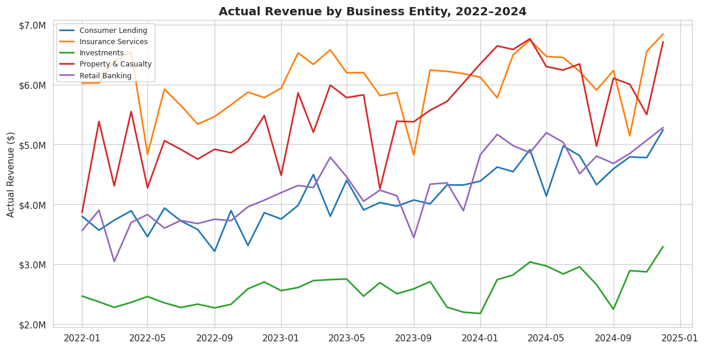
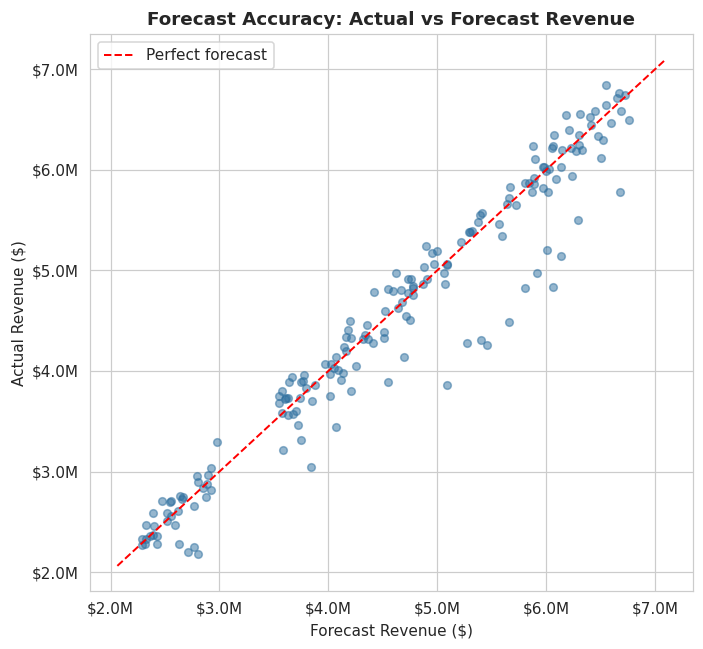
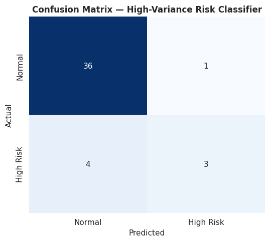
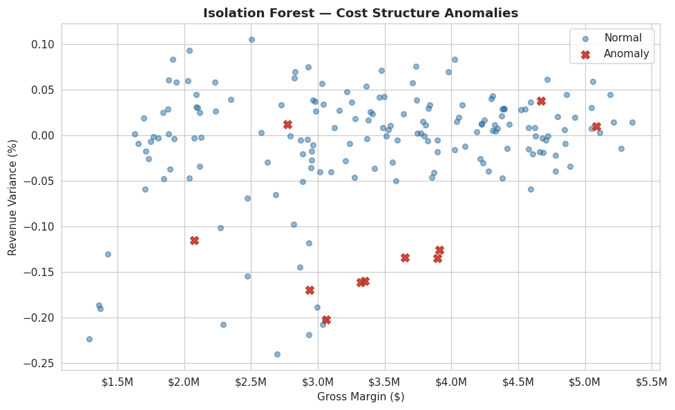

# Revenue Forecasting & Financial Risk Analytics

**Korede Katibi, MBA** — Data Scientist portfolio project

A machine learning and SQL analysis of business-finance revenue forecasting and variance risk, built
on the kind of revenue guidance, forecast consolidation, and risk analysis work in my background at
USAA, Appen, and PSI LLC (see resume). This project translates that finance domain experience into a
Data Scientist skill set: Python, SQL, statistical modeling, and machine learning.

## Business question

Finance teams produce a monthly revenue forecast for each business entity. Two questions:
1. Can a data-driven model improve on that forecast, beyond what the finance team already produces?
2. Can we predict *which* entity-months are at risk of a material forecast miss, before the numbers close?

## Skills demonstrated

| Skill | Where it lives |
|---|---|
| Python (pandas, numpy) | `generate_data.py`, `analysis.py` — data generation, feature engineering, all analysis |
| SQL | 5 `.sql` files — window functions (LAG, rolling average), CTEs, joins, aggregation, run against `revenue_forecast.db` |
| Exploratory Data Analysis | `revenue_forecasting_analysis.ipynb` Section 2 — trend, seasonality, correlation analysis |
| Regression modeling | Linear Regression vs Random Forest, benchmarked against a naive baseline |
| Classification | Random Forest classifier for high-variance-risk prediction, with class imbalance handling |
| Anomaly detection | Isolation Forest, unsupervised, on cost structure |
| Model evaluation | MAPE, R², precision/recall/F1, ROC-AUC, confusion matrix |
| Data visualization | matplotlib/seaborn — 8 charts covering EDA, model diagnostics, and results |
| Business communication | Executive summary translating model output into a stakeholder recommendation |

## Key results

- **Forecasting:** the finance team's own forecast is already fairly accurate (5.85% MAPE). A Linear
  Regression model with seasonality and lag features narrows this slightly to 5.80% MAPE. **Random
  Forest actually performed worse (6.56% MAPE)** — with only 175 training rows it overfit relative to
  the simpler model. I kept this result in rather than hiding it: the honest conclusion from limited
  data is to prefer the simpler model, not the more sophisticated one by default.
- **Risk classification:** a Random Forest classifier flags high-variance-risk entity-months with 75%
  precision and a 0.78 ROC-AUC, driven mainly by anomalous legal cost activity. Framed as a triage tool
  for the monthly variance review rather than a full replacement for analyst judgment.
- **Anomaly detection:** an unsupervised Isolation Forest check independently corroborates several of
  the same high-risk months and surfaces a possible structural cost difference in one business entity
  worth a follow-up review.

See the notebook's Section 6 (Executive Summary) for the full write-up.

## Repo contents

| File | What it is |
|---|---|
| `revenue_forecasting_analysis.ipynb` | **Main deliverable — open this first.** EDA, models, results, executive summary, all with saved outputs and charts. |
| `revenue_forecast_data.csv` | Synthetic dataset (180 rows: 5 entities × 36 months). |
| `revenue_forecast.db` | The same data in SQLite, used by the SQL queries below. |
| `01_monthly_variance_by_entity.sql` | Basic variance calculation by entity and month. |
| `02_month_over_month_change.sql` | Window function example (LAG). |
| `03_high_risk_entities_ranked.sql` | CTEs + join, ranking entities by risk rate. |
| `04_rolling_3month_avg_variance.sql` | Window frame example (rolling average). |
| `05_cost_structure_summary.sql` | Cost structure as % of revenue by entity. |
| `generate_data.py` | Script that generated the synthetic dataset. |
| `analysis.py` | Script that runs the full EDA + modeling pipeline and produces the chart images. |
| `build_sql.py` | Script that builds the SQLite database and the `.sql` query files. |
| `build_notebook.py` | Script that assembles the Jupyter notebook. |
| `*.png` (8 files) | Chart images, embedded in the notebook and referenced below. |
| `requirements.txt` | Python dependencies. |

## Charts

**Revenue trend across business entities, with visible seasonality and disruption events**


**Forecast accuracy — how close the finance team's own forecast already is**


**High-variance risk classifier — confusion matrix**


**Anomaly detection on cost structure**


## How to run it

```bash
pip install -r requirements.txt
jupyter notebook revenue_forecasting_analysis.ipynb
```

The notebook already contains saved outputs and charts, so it's fully readable on GitHub without
running anything. To reproduce or extend the analysis: `python generate_data.py` then `python analysis.py`
then `python build_sql.py` then `python build_notebook.py`.

For the SQL queries, open `revenue_forecast.db` in any SQLite client (e.g., DB Browser for SQLite, or
`sqlite3 revenue_forecast.db` from the command line) and run any of the `.sql` files.

## Honest technical notes

- **All data is synthetic**, generated to reflect realistic relationships (seasonality, trend, cost
  spikes correlated with revenue disruptions) common in corporate revenue/cost forecasting — not real
  employer data from USAA, Appen, or PSI LLC.
- The dataset is deliberately small (180 rows) to mirror a realistic monthly-close reporting cadence
  (a handful of business entities, a few years of history) rather than a large ML training set. This is
  exactly the data-volume constraint referenced in the Random Forest result above, and is called out
  explicitly in the notebook rather than glossed over.
- Model results (MAPE, ROC-AUC, etc.) are computed from a single train/test split for clarity; a
  production version would use time-series cross-validation given the temporal structure of the data.
